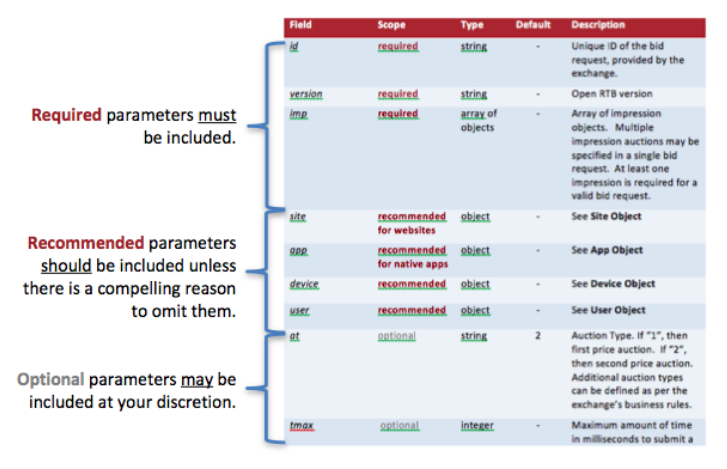
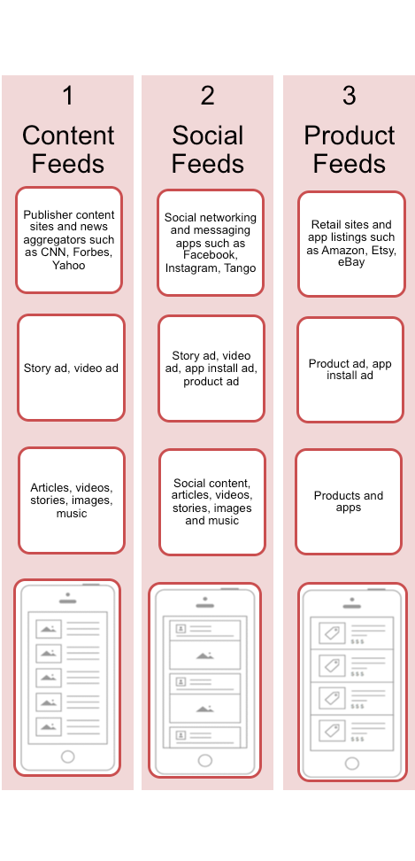
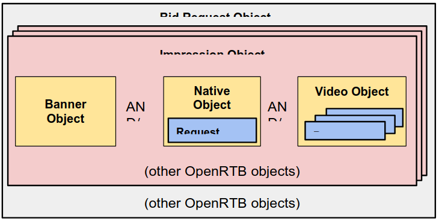
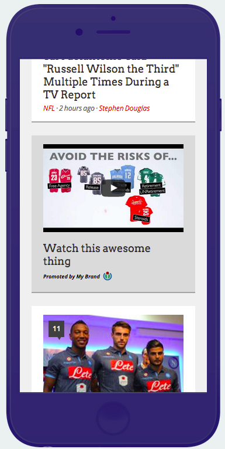

>
> ***Introduction***
>
> *The* *Native* *Ads* *sub-committee* *of* *the* *IAB* *OpenRTB*
> *Project* *assembled* *in* *May* *2014* *to* *develop* *a* *new*
> *supplementary* *API* *specification* *for* *companies* *interested*
> *in* *an* *open* *protocol* *for* *the* *automated* *trading* *of*
> *Native* *Ads* *enabled* *media* *across* *a* *broader* *range* *of*
> *platforms,* *devices,* *and* *advertising* *solutions.* *This*
> *document* *is* *the* *culmination* *of* *those* *efforts.*
>
> ***ABOUT*** ***THE*** ***IAB’S*** ***TECHNOLOGY*** ***LAB***
>
> *The* *IAB* *Technology* *Laboratory* *is* *a* *nonprofit* *research*
> *and* *development* *consortium* *charged* *with* *producing* *and*
> *helping* *companies* *implement* *global* *industry* *technical*
> *standards* *and* *solutions.* *The* *goal* *of* *the* *Tech* *Lab*
> *is* *to* *reduce* *friction* *associated* *with* *the* *digital*
> *advertising* *and* *marketing* *supply* *chain* *while*
> *contributing* *to* *the* *safe* *growth* *of* *an* *industry.*
>
> *The* *IAB* *Tech* *Lab* *spearheads* *the* *development* *of*
> *technical* *standards,* *creates* *and* *maintains* *a* *code*
> *library* *to* *assist* *in* *rapid,* *cost-effective*
> *implementation* *of* *IAB* *standards,* *and* *establishes* *a*
> *test* *platform* *for* *companies* *to* *evaluate* *the*
> *compatibility* *of* *their* *technology* *solutions* *with* *IAB*
> *standards,* *which* *for* *18* *years* *have* *been* *the*
> *foundation* *for* *interoperability* *and* *profitable* *growth* *in*
> *the* *digital* *advertising* *supply* *chain.*
>
> ***Further*** ***details*** ***about*** ***the*** ***IAB***
> ***Technology*** ***Lab*** ***can*** ***be*** ***found*** ***at:***
> ***https://iabtechlab.com/**.* *The* *OpenRTB* *Work* *Group* *is* *a*
> *working* *group* *within* *the* *IAB* *Technology* *Lab.*
>
> *This* *document* *can* *be* *found* *at*
> *https://iabtechlab.com/specifications-guidelines/openrtb-dynamic-native-ads-api-1-2/*
>
> *IAB* *Contact* *Information:* \
> *Jennifer* *Derke* \
> *IAB* *Technology* *Laboratory* \
> *jennifer@iabtechlab.com*
>
> ***License***
> *OpenRTB* *Specification*
> *by* *<u>OpenRTB</u>* *is* *licensed* *under* *a* *<u>Creative Commons
> Attribution 3.0</u>* *<u>License</u>,* *based* *on* *a* *work* *at*
> *<u>openrtb.info.</u>* *Permissions* *beyond* *the* *scope* *of*
> *this* *license* *may* *be* *available* *at*
> *<u>http://openrtb.info.</u>* *To* *view* *a* *copy* *of* *this*
> *license,* *visit*
> *<u>http://creativecommons.org/licenses/by/3.0/</u>* *or* *write* *to*
> *Creative* *Commons,* *171* *Second* *Street,* *Suite* *300,* *San*
> *Francisco,* *CA* *94105,* *USA.*
> 
> 

>
> Table of Contents
> 
> *<u>Change Log</u>*
>
> *<u>Before You Get Started</u>*
>
> *<u>1 Introduction</u>*
>
> &nbsp;&nbsp;&nbsp;*<u>1.1 Mission / Overview</u>*
>
> &nbsp;&nbsp;&nbsp;*<u>1.2 Credits / Project History</u>* 
> 
> &nbsp;&nbsp;&nbsp;*<u>1.3 Resources</u>*
>
> &nbsp;&nbsp;&nbsp;*<u>1.4 Version History</u>*
>
> *<u>2 Native Ads Basics</u>*
>
> &nbsp;&nbsp;&nbsp;*<u>2.1 In-Feed Ad Units</u>* 
> 
> &nbsp;&nbsp;&nbsp;*<u>2.2 Data Format</u>*
>
> &nbsp;&nbsp;&nbsp;*<u>2.3 Versioning</u>*
>
> &nbsp;&nbsp;&nbsp;*<u>2.4 Customization and Extensions</u>*
>
> *<u>3 Bid Request Details</u>*
>
> &nbsp;&nbsp;&nbsp;*<u>3.1 Native Object Hierarchy</u>*
>
> *<u>4 Native Ad Request Markup Details</u>* 
> 
> &nbsp;&nbsp;&nbsp;*<u>4.1 Native Markup Request Object</u>* 
>
> &nbsp;&nbsp;&nbsp;*<u>4.2 Asset Request Object</u>*
>
> &nbsp;&nbsp;&nbsp;*<u>4.3 Title Request Object</u>* 
>
> &nbsp;&nbsp;&nbsp;*<u>4.4 Image Request Object</u>*
> 
> &nbsp;&nbsp;&nbsp;*<u>4.5 Video Request Object</u>* 
>
> &nbsp;&nbsp;&nbsp;*<u>4.6 Data Request Object</u>*
>
> &nbsp;&nbsp;&nbsp;*<u>4.7 Event Trackers Request Object</u>*
>
> *<u>5 Native Ad Response Markup Details</u>* 
>
> &nbsp;&nbsp;&nbsp;*<u>5.1 Native Markup Response Object</u>* 
> 
> &nbsp;&nbsp;&nbsp;*<u>5.2 Asset Response Object</u>*
>
> &nbsp;&nbsp;&nbsp;*<u>5.3 Title Response Object</u>* 
>
> &nbsp;&nbsp;&nbsp;*<u>5.4 Image Response Object</u>*
> 
> &nbsp;&nbsp;&nbsp;*<u>5.5 Data Response Object</u>* 
> 
> &nbsp;&nbsp;&nbsp;*<u>5.6 Video Response Object</u>*
> 
> &nbsp;&nbsp;&nbsp;*<u>5.7 Link Response Object</u>*
>
> &nbsp;&nbsp;&nbsp;*<u>5.8 Event Tracker Response Object</u>*
>
> *<u>6 Bid Request/Response Samples</u>*
>
> &nbsp;&nbsp;&nbsp;*<u>6.1 Social Context, Clickout Response</u>* 
> 
> &nbsp;&nbsp;&nbsp;&nbsp;&nbsp;&nbsp;*<u>Bid Request</u>*
>
> &nbsp;&nbsp;&nbsp;&nbsp;&nbsp;&nbsp;*<u>Bid Response</u>*
>
> &nbsp;&nbsp;&nbsp;*<u>6.2 Content Context, Video Response</u>* 
> 
> &nbsp;&nbsp;&nbsp;&nbsp;&nbsp;&nbsp;*<u>Bid Request</u>*
>
> &nbsp;&nbsp;&nbsp;&nbsp;&nbsp;&nbsp;*<u>Bid Response</u>*
>
> &nbsp;&nbsp;&nbsp;*<u>6.3 Third-Party Ad Serving Example</u>* 
> 
> &nbsp;&nbsp;&nbsp;&nbsp;&nbsp;&nbsp;*<u>Bid Request</u>*
>
> &nbsp;&nbsp;&nbsp;&nbsp;&nbsp;&nbsp;*<u>Bid Response</u>*
>
> &nbsp;&nbsp;&nbsp;&nbsp;&nbsp;&nbsp;*<u>What Should be Returned by the Assets URL</u>*
>
> *<u>7 Reference Lists/Enumerations</u>* 
> 
> &nbsp;&nbsp;&nbsp;*<u>7.1 Context Type IDs</u>*
>
> &nbsp;&nbsp;&nbsp;*<u>7.2 Context Sub Type IDs</u>* 
> 
> &nbsp;&nbsp;&nbsp;*<u>7.3 Placement Type IDs</u>*
> 
> &nbsp;&nbsp;&nbsp;*<u>7.4 Data Asset Types</u>*
>
> &nbsp;&nbsp;&nbsp;*<u>7.5 Image Asset Types</u>* 
> 
> &nbsp;&nbsp;&nbsp;*<u>7.6 Event Types Table</u>*
>
> &nbsp;&nbsp;&nbsp;*<u>7.7 Event Tracking Methods Table</u>*

> **Change** **Log**
>
> | Version | Date      | Section Link                          | Change                                                                                                                                                                                                                                                                                                             |
> |:--------|:----------|:--------------------------------------|:-------------------------------------------------------------------------------------------------------------------------------------------------------------------------------------------------------------------------------------------------------------------------------------------------------------------|
> | 1.0     | Jan 2015  | string                                | Original Version                                                                                                                                                                                                                                                                                                   |
> | 1.1     | Oct 2015  | string                                | Various clerical fixes and clarifications, standardized creative element lengths/sizes/aspect ratios in the asset sub-objects, added new context and placement types to bid request, noted that direct-object representation is supported along with string- encoded. See 1.1 spec for further change log details. |
> | 1.2     | Mar 2017  | Request                               | As previewed in 1.1, deprecating the AdUnit and LayoutID fields - they were replaced in 1.1 with Placement and Context.                                                                                                                                                                                            |
> | 1.2     | Mar 2017  | Event Trackers, Request, Response     | Add new support for declared types of event tracking in the bid request and an array of responses for tracking in the response. Marking previous imptrackers and jstracker as to be deprecated.                                                                                                                    |
> | 1.2     | Mar 2017  | Request, Response                     | Added support for supply source to indicate whether they support displaying a link to a custom privacy notice, and for transmitting said URL in the response.                                                                                                                                                      |
> | 1.2     | Mar 2017  | Request, Response, Title, Data, Image | Added support for third-party ad serving / dynamic creative by establishing a way to respond with a URL to retrieve the assets rather than including all the assets inline.                                                                                                                                        |
> | 1.2     | Mar 2017  | Examples                              | Updated examples to reflect all above changes                                                                                                                                                                                                                                                                      |
> | 1.2     | July 2017 | Request, Response                     | Added support for Dynamic Content Specification as an alternate method for third-party ad serving, in beta.                                                                                                                                                                                                        |
> 
> **Before** **You** **Get** **Started**
>
> This specification contains a detailed explanation of a sub-protocol
> of the OpenRTB real-time bidding interface. Not all objects are
> required, and each object may contain a number of optional parameters.
> To assist a first time reader of the specification, we have indicated
> which fields are essential to support a minimum viable real time
> bidding interface for various scenarios.
>
> A minimal viable interface should include the **required** and
> **recommended** parameters, but the scope for these parameters may be
> limited to specific scenarios. In these cases, the scope will be
> qualified with the applicable scenarios (e.g., **required** **for**
> **native** **impressions** and **recommended** **for** **native**
> **impressions**). Conversely, if the scope is not qualified, it
> applies to all scenarios.
>
> Optional parameters may be included to ensure maximum value is derived
> by the parties.
> 
> 
> 
> **IMPORTANT:** Since **recommended** parameters are not required, they
> may not be available from all supply sources. It is suggested that all
> parties to OpenRTB transaction complete the integration checklist
> (please refer to OpenRTB) to identify which parameters the supply side
> supports in the bid request, and which parameters the demand side
> requires for ad decisioning.

**1** **Introduction**
>
> **1.1** **Mission** **/`x** **Overview**
>
> The mission of the OpenRTB Native project is to spur standardization
> and greater growth in the Real-Time Bidding (RTB) marketplace for
> Native Ads by providing open industry standards for communication
> between buyers of advertising and sellers of publisher inventory.
>
> This specification is a sub-protocol of OpenRTB to allow for the
> delivery of native advertising formats, as their specifics differ from
> publisher to publisher. In May 2013, a separate IAB subcommittee was
> formed to define the request and response structures of native ad
> units; version 1.0 was published in early 2015.
>
> Version 1.1 is designed to fix errors, make clarifications, and
> promote further adoption through refined standardization of assets and
> classification fields.
>
> Version 1.2 adds support for third-party/dynamic creatives, more
> robust event-tracking support, privacy opt-out information sharing,
> and makes other minor enhancements as noted in the change log.

>
>
> **1.2** **Credits** **/** **Project** **History**
>
> This document has been developed by the IAB Technology Lab’s OpenRTB
> Native Subgroup. The OpenRTB Working Group mission and participation
> list can be reviewed at:
> <u>http://www.iab.com/guidelines/real-time-bidding-rtb-project/</u>
>
> Neal Richter & Avinash Shahdadpuri, Rubicon Project
>
> Jim Butler, Nexage
>
> Ilana Grumer \[current\], Adam Morgenlender \[former\] & Gabor Cselle
> \[former\], Twitter
>
> Narayanan Balakrishnan & Anand Narayanan, InMobi
>
> Giuseppe Di Mauro, PubMatic
>
> Ilya Kaplun, Visible Measures
>
> Jennifer Lum, Adelphic
>
> Wesley Biggs, Byyd
>
> Benoit Grouchko & Elisabeth Rotrou \[former\] & Pierre Nicolas, Criteo
>
> David Hernandez, AOL
>
> Rajaraman Periasamy, RocketFuel
>
> Jin Yu, OpenX
>
> Anton Roslov, Phorm
>
> Andraž Tori, Zemanta
>
> Osvaldo Doederlein, Google
>
> Benu Shroff, Turn
>
> Curt Larson, Sharethrough Kuldeep Kapade, AdsNative Byron Ellis,
> Spongecell
>
> Michael Feeley, Cory LaMay & Jayant Kumar, Bidtellect

>
> **1.3** **Resources**
> 
>| Resource                                                               |                                                       Location                                                       |
>|:-----------------------------------------------------------------------|:--------------------------------------------------------------------------------------------------------------------:|
>| OpenRTB Website                                                        |                                           https://iabtechlab.com/openrtb/                                            |
>| OpenRTB Native Ads Project Page                                        |                                   http://github.com/openrtb/OpenRTB/NativeAds.html                                   |
>| Developer / Product Manager Mailing List                               |                                    http://groups.google.com/group/openrtb-native                                     |
>| Making Sense of Programmatic Native (“OpenRTB for native for dummies”) |                                http://www.sharethrough.com/guides/programmatic-native                                |
>| IAB Deep-Dive on In-Feed Ads                                           |                          http://www.iab.net/media/file/IAB_Deep_Dive_on_InFeed_Ad_Units.pdf                          |
>| IAB Native Advertising Playbook                                        |                          http://www.iab.net/media/file/IAB-Native-Advertising-Playbook2.pdf                          |
>| Guide to Native 1.1                                                    | http://nativeadvertising.com/openrtb-2-4-and-native-1-1-the-new-iab-standards-that-are-allowing-native-ads-to-scale/ |

> **1.4** **Version** **History**
>
> Version 0.99.10.24 PUBLIC COMMENT DRAFT October 24, 2014 \
> Version 0.99.10.27 PUBLIC COMMENT DRAFT October 27, 2014 \
> Version 1.0.0.0 EXTERNAL DRAFT November 19, 2014 \
> Version 1.0.0.1 EXTERNAL DRAFT December 14, 2014 \
> Version 1.0.0.2 FINAL DRAFT January 23, 2015  \
> Version 1.1 FINAL DRAFT March 22, 2015 \
> Version 1.2 PUBLIC COMMENT DRAFT April, 2017  
> Version 1.2 FINAL DRAFT July 2017

**2** **Native** **Ads** **Basics**

> Native advertising is an online advertising method in which the
> advertiser attempts to gain attention by providing content in the
> context of the user's experience. Native ad formats match both the
> form and function of the user experience in which it is placed. This
> is in contrast to traditional banner or interstitials ads, which are
> displayed in a separate space of predefined and universal size,
> without regard to their surroundings.

**2.1** **In-Feed** **Ad** **Units**

> To help define and clarify the types and categories of native advertising, the IAB published a <u>Deep Dive on In-Feed
> Ad Units</u> in July 2015. Version 1.1 and forward of the Native spec use these concepts to define the definitions of
> ad
> types, detailed below as Context and PlacementType, which are replacing the previous LayoutID and AdUnitID, which were
> defined in Native 1.0 and based on the original Native Advertising Playbook.
> 

>
> **2.2** **Data** **Format**
>
> As this specification outlines an optional sub-protocol of the main
> OpenRTB protocol payload, the format must follow that of its parent.
> Please refer to the main OpenRTB specification for details of various
> formats that may be used
>
> **2.3** **Versioning**
>
> The Native Object in the Bid Request (OpenRTB contains a “ver” field
> defining the version of the OpenRTB native extension*.*
>
> **2.4** **Customization** **and** **Extensions**
>
> The OpenRTB Native Ads spec allows for exchange specific customization
> and extensions of the specification. Any object may contain
> extensions. In order to keep extension fields consistent across
> platforms, they should consistently be named “ext”.

**3** **Bid** **Request** **Details**

> RTB transactions are initiated when an exchange or other supply source
> sends a bid request to a bidder. The bid request consists of a bid
> request object, at least one impression object, and may optionally
> include additional objects providing impression context.
>
> **3.1** **Native** **Object** **Hierarchy**
>
> Following is the object hierarchy for a bid request. The new Native
> Object is another optional element of the impression object, and can
> be specified as an alternative to or in conjunction with a banner
> object or video object.
>
> > 

**4** **Native** **Ad** **Request** **Markup** **Details**

> **4.1** **Native** **Markup** **Request** **Object**
>
> The Native Object defines the native advertising opportunity available
> for bid via this bid request. It will be included as a JSON-encoded
> string in the bid request’s imp.native field or as a direct JSON
> object, depending on the choice of the exchange. *While* *OpenRTB*
> *2.x* *officially* *supports* *only* *JSON-encoded* *strings,* *many*
> *exchanges* *have* *implemented* *a* *formal* *object.* *Check* *with*
> *your* *integration* *docs.*
>
> The **Default** column dictates how optional parameters should be
> interpreted if explicit values are not provided.
>
> | Field          | Scope       | Type             | Default | Description                                                                                                                                                                                                                                                                                                                |
> |:---------------|:------------|:-----------------|:--------|:---------------------------------------------------------------------------------------------------------------------------------------------------------------------------------------------------------------------------------------------------------------------------------------------------------------------------|
> | ver            | optional    | string           | 1.2     | Version of the Native Markup version in use.                                                                                                                                                                                                                                                                               |
> | context        | recommended | integer          | -       | The context in which the ad appears. See Table of Context IDs below for a list of supported context types.                                                                                                                                                                                                                 |
> | contextsubtype | optional    | integer          | -       | A more detailed context in which the ad appears. See Table of Context SubType IDs below for a list of supported context subtypes.                                                                                                                                                                                          |
> | plcmttype      | recommended | integer          | -       | The design/format/layout of the ad unit being offered. See Table of Placement Type IDs below for a list of supported placement types.                                                                                                                                                                                      |
> | plcmtcnt       | optional    | integer          | 1       | The number of identical placements in this Layout. Refer Section 8.1 Multiplacement Bid Requests for further detail.                                                                                                                                                                                                       |
> | seq            | optional    | integer          | 0       | 0 for the first ad, 1 for the second ad, and so on. Note this would generally NOT be used in combination with plcmtcnt - either you are auctioning multiple identical placements (in which case plcmtcnt>1, seq=0) or you are holding separate auctions for distinct items in the feed (in which case plcmtcnt=1, seq=>=1) |
> | assets         | required    | array of objects | -       | An array of Asset Objects. Any bid response must comply with the array of elements expressed in the bid request.                                                                                                                                                                                                           |
> | aurlsupport    | optional    | int              | 0       | Whether the supply source / impression supports returning an assetsurl instead of an asset object. 0 or the absence of the field indicates no such support.                                                                                                                                                                |
> | durlsupport    | optional    | int              | 0       | Whether the supply source / impression supports returning a dco url instead of an asset object. 0 or the absence of the field indicates no such support. Beta feature.                                                                                                                                                     |
> | eventtrackers  | optional    | array of objects | -       | Specifies what type of event tracking is supported - see Event Trackers Request Object                                                                                                                                                                                                                                     |
> | privacy        | recommended | integer          | 0       | Set to 1 when the native ad supports buyer-specific privacy notice. Set to 0 (or field absent)when the native ad doesn’t support custom privacy links or if support is unknown.                                                                                                                                            |
> | ext            | optional    | object           | -       | This object is a placeholder that may contain custom JSON agreed to by the parties to support flexibility beyond the standard defined in this specification                                                                                                                                                                |

> **Note:** Prior to VERSION 1.1, the specification could be interpreted
> as requiring the native request to have a root node with a single
> field “native” that would contain the object above as its value. The
> Native Markup Request Object specified above is now the root object.

> **4.2** **Asset** **Request** **Object**
>
> The main container object for each asset requested or supported by Exchange on behalf of the rendering client. Any
> object that is required is to be flagged as such. Only one of the {title,img,video,data} objects should be present in
> each object. All others should be null/absent. The id is to be unique within the AssetObject array so that the
> response
> can be aligned.
>
> To be more explicit, it is the ID of each asset object that maps the response to the request. So if a request for a
> title object is sent with id 1, then the response containing the title should have an id of 1.
>
>Since version 1.1 of the spec, there are recommended sizes/lengths/etc with some of the asset types. The goal for asset
> requirements standardization is to facilitate adoption of native by DSPs by limiting the diverse
> types/sizes/requirements of assets they must have available to purchase a native ad impression. While great diversity
> may exist in publishers, advertisers/DSPs can not be expected to provide infinite headline lengths, thumbnail aspect
> ratios, etc. While we have not gone as far as creating a single standard, we've honed in on a few options that cover
> the
> most common cases. SSPs can deviate from these standards, but should understand they may limit applicable DSP demand
> by
> doing so. DSPs should feel confident that if they support these standards they'll be able to access most native
> inventory.
>
> | Field         | Scope          | Type   | Default | Description                                                                                                                                                                                              |
> |:--------------|:---------------|:-------|:--------|:---------------------------------------------------------------------------------------------------------------------------------------------------------------------------------------------------------|
> | id            | required       | int    | -       | Unique asset ID, assigned by exchange. Typically a counter for the array.                                                                                                                                |
> | required      | optional       | int    | 0       | Set to 1 if asset is required (exchange will not accept a bid without it)                                                                                                                                |
> | title         | 1. recommended | object | -       | Title object for title assets. See TitleObject definition.                                                                                                                                               |
> | img           | 1. recommended | object | -       | Image object for image assets. See ImageObject definition.                                                                                                                                               |
> | video         | 1. optional    | object | -       | Video object for video assets. See the Video request object definition. Note that in-stream(ie preroll, etc) video ads are not part of Native. Native ads may contain a video as the ad creative itself. |
> | data          | 1. recommended | object | -       | Data object for brand name, description, ratings, prices etc. See DataObject definition.                                                                                                                 |
> | ext           | optional       | object | -       | This object is a placeholder that may contain custom JSON agreed to by the parties to support flexibility beyond the standard defined in this specification                                              |
> 1: each asset object may contain only one of title, img, data or video.

**4.3** **Title** **Request** **Object**

> The Title object is to be used for title element of the Native ad.
>
> | Field | Scope          | Type   | Default | Description                                                                                                                                                 |
> |:------|:---------------|:-------|:--------|:------------------------------------------------------------------------------------------------------------------------------------------------------------|
> | len   | required       | int    | -       | Maximum length of the text in the title element. Recommended to be 25, 90, or 140.                                                                          |
> | ext   | optional       | object | -       | This object is a placeholder that may contain custom JSON agreed to by the parties to support flexibility beyond the standard defined in this specification | 

**4.4** **Image** **Request** **Object**

> The Image object to be used for all image elements of the Native ad
> such as Icons, Main Image, etc. **Recommended** **sizes** **and**
> **aspect** **ratios** **are** **included** **in** **the** **<u>Image
> Asset Types</u>** **section.**
>
> | Field | Scope        | Type     | Default           | Description                                                                                                                                                                                                                                                                                                                                 |
> |:------|:-------------|:---------|:------------------|:--------------------------------------------------------------------------------------------------------------------------------------------------------------------------------------------------------------------------------------------------------------------------------------------------------------------------------------------|
> | type  | optional     | integer  | -                 | Type ID of the image element supported by the publisher. The publisher can display this information in an appropriate format. See Table Image Asset Types.                                                                                                                                                                                  |
> | w     | optional     | integer  | -                 | Width of the image in pixels.                                                                                                                                                                                                                                                                                                               |
> | wmin  | recommended  | integer  | -                 | The minimum requested width of the image in pixels. This option should be used for any rescaling of images by the client. Either w or wmin should be transmitted. If only w is included, it should be considered an exact requirement.                                                                                                      |
> | h     | optional     | integer  | -                 | Height of the image in pixels.                                                                                                                                                                                                                                                                                                              |
> | hmin  | recommended  | integer  | -                 | The minimum requested height of the image in pixels. This option should be used for any rescaling of images by the client. Either h or hmin should be transmitted. If only h is included, it should be considered an exact requirement.                                                                                                     |
> | mimes | optional     | array    | All types allowed | Whitelist of content MIME types supported. Popular MIME types include, but are not limited to “image/jpg” “image/gif”. Each implementing Exchange should have their own list of supported types in the integration docs. See Wikipedia's MIME page for more information and links to all IETF RFCs. If blank, assume all types are allowed. |
> | ext   | optional     | object   | -                 | This object is a placeholder that may contain custom JSON agreed to by the parties to support flexibility beyond the standard defined in this specification.                                                                                                                                                                                |

***4.5*** ***Video*** ***Request*** ***Object***

> The video object to be used for all video elements supported in the
> Native Ad. This corresponds to the Video object of OpenRTB. Exchange
> implementers can impose their own specific restrictions. Here are the
> required attributes of the Video Object. For optional attributes
> please refer to OpenRTB.
>
> | Field        | Scope        | Type              | Default | Description                                                                                                                                                                                                                          |
> |:-------------|:-------------|:------------------|:--------|:-------------------------------------------------------------------------------------------------------------------------------------------------------------------------------------------------------------------------------------|
> | mimes        | required     | array of string   |         | Content MIME types supported.popular MIME types include,but are not limited to “video/x-ms- wmv” for Windows Media, and “video/x-flv” for Flash Video, or “video/mp4”. Note that native frequently does not support flash.           |
> | minduration  | required     | integer           | -       | Minimum video ad duration in seconds.                                                                                                                                                                                                |
> | maxduration  | required     | integer           | -       | Maximum video ad duration in seconds.                                                                                                                                                                                                |
> | protocols    | required     | array of integers | -       | An array of video protocols the publisher can accept in the bid response. See OpenRTB Table ‘Video Bid Response Protocols’ for a list of possible values.                                                                            |
> | ext          | optional     | object            | -       | This object is a placeholder that may contain custom JSON agreed to by the parties to support flexibility beyond the standard defined in this specification.                                                                         |

>
> **4.6** **Data** **Request** **Object**
>
> The Data Object is to be used for all non-core elements of the native
> unit such as Brand Name, Ratings, Review Count, Stars, Download count,
> descriptions etc. It is also generic for future native elements not
> contemplated at the time of the writing of this document. In some
> cases, additional recommendations are also included in the <u>Data
> Asset Types</u> table.
>
>
> | Field | Scope          | Type    | Default | Description                                                                                                                                                                    |
> |:------|:---------------|:--------|:--------|:-------------------------------------------------------------------------------------------------------------------------------------------------------------------------------|
> | type  | required       | integer | -       | Type ID of the element supported by the publisher. The publisher can display this information in an appropriate format. See Data Asset Types table for commonly used examples. |
> | len   | optional       | integer | -       | Maximum length of the text in the element’s response.                                                                                                                          | 
> | ext   | optional       | object  | -       | This object is a placeholder that may contain custom JSON agreed to by the parties to support flexibility beyond the standard defined in this specification                    | 

> **4.7** **Event** **Trackers** **Request** **Object**
>
> The event trackers object specifies the types of events the bidder can
> request to be tracked in the bid response, and which types of tracking
> are available for each event type, and is included as an array in the
> request.
>
> | Field   | Scope    | Type              | Default | Description                                                                                                                                                 |
> |:--------|:---------|:------------------|:--------|:------------------------------------------------------------------------------------------------------------------------------------------------------------|
> | event   | required | integer           | -       | Type of event available for tracking. See Event Types table.                                                                                                |
> | methods | required | array of integers | -       | Array of the types of tracking available for the given event. See Event Tracking Methods table.                                                             | 
> | ext     | optional | object            | -       | This object is a placeholder that may contain custom JSON agreed to by the parties to support flexibility beyond the standard defined in this specification | 

**5** **Native** **Ad** **Response** **Markup** **Details**

> The structure and contents of the Bid Response are the same as in the
> OpenRTB standard. The difference is in how the ad creative is
> returned. The native creative shall be returned as a JSON-encoded
> string in the adm field of the Bid Object. Note some implementers have
> chosen to use a direct object in a new field rather than JSON encoded
> string.
>
> **5.1** **Native** **Markup** **Response** **Object**
>
> The native object is the top level JSON object which identifies a
> native response. The native object has following attributes:

> | Field          | Scope       | Type             | Default | Description                                                                                                                                                                                                                                                                                                                                                                                                                                                                                     |
> |:---------------|:------------|:-----------------|:--------|:------------------------------------------------------------------------------------------------------------------------------------------------------------------------------------------------------------------------------------------------------------------------------------------------------------------------------------------------------------------------------------------------------------------------------------------------------------------------------------------------|
> | ver            | recommended | string           | “1.2”   | Version of the Native Markup version in use.                                                                                                                                                                                                                                                                                                                                                                                                                                                    |
> | assets         | recommended | array of objects | -       | List of native ad’s assets.Required if no assetsurl. Recommended as fallback even if assetsurl is provided.                                                                                                                                                                                                                                                                                                                                                                                     |
> | assetsurl1     | optional    | string           | -       | URL of an alternate source for the assets object. The expected response is a JSON object mirroring the assets object in the bid response, subject to certain requirements as specified in the individual objects. Where present, overrides the asset object in the response.                                                                                                                                                                                                                    |
> | dcourl         | optional    | string           |         | URL where a dynamic creative specification may be found for populating this ad, per the Dynamic Content Ads Specification. Note this is a beta option as the interpretation of the Dynamic Content Ads Specification and how to assign those elements into a native ad is outside the scope of this spec and must be agreed offline between the parties or as may be specified in a future revision of the Dynamic Content Ads spec. Where present, overrides the asset object in the response. |
> | link           | required    | object           | -       | Destination Link. This is default link object for the ad. Individual assets can also have a link object which applies if the asset is activated(clicked). If the asset doesn’t have a link object, the parent link object applies. See LinkObject Definition                                                                                                                                                                                                                                    |
> | imptrackers    | optional    | array of string  | -       | Array of impression tracking URLs, expected to return a 1x1 image or 204 response - typically only passed when using 3rd party trackers. To be deprecated - replaced with eventtrackers.                                                                                                                                                                                                                                                                                                        |
> | jstracker      | optional    | string           | -       | Optional JavaScript impression tracker. This is a valid HTML, Javascript is already wrapped in `<script>` tags. It should be executed at impression time where it can be supported. To be deprecated - replaced with eventtrackers.                                                                                                                                                                                                                                                             |
> | eventtrackers  | optional    | Array of objects | -       | Array of tracking objects to run with the ad, in response to the declared supported methods in the request. Replaces imptrackers and jstracker, to be deprecated.                                                                                                                                                                                                                                                                                                                               |
> | privacy        | optional    | string           | -       | If support was indicated in the request, URL of a page informing the user about the buyer’s targeting activity.                                                                                                                                                                                                                                                                                                                                                                                 |
> | ext            | optional    | object           | -       | This object is a placeholder that may contain custom JSON agreed to by the parties to support flexibility beyond the standard defined in this specification                                                                                                                                                                                                                                                                                                                                     |

> *1* The provided “assetsurl” or “dcourl” should be expected to provide
> a valid response when called in any context, including importantly the
> brand name and example thumbnails and headlines (to use for reporting,
> blacklisting, etc), but it is understood the final actual call should
> come from the client device from which the ad will be rendered to give
> the buyer the benefit of the cookies and header data available in that
> context.

>
> **Note:** Prior to VERSION 1.1, the native response’s root node was an
> object with a single field “native” that would contain the object
> above as its value. The Native Object specified above is now the root
> object.
>
> **Note** **re:** **assetsurl** **format** **responses:** In the case
> of assetsurl or dcourl (beta) bidding, since the ultimate
> buyer/creative engine cannot alter the assets response based on the
> details inside the assets request (as it does not receive said
> request), it is critical that all required assets are provided, and
> such communications will need to be handled offline for
> recommended/optional elements.
>
> In the normal embedded response, certain attributes of the response
> are assumed based on matching the ID of the asset object in the
> response to the ID of the asset object in the request. Since the asset
> response will not be reading the asset request directly in this
> implementation, that information is added as option in the below
> object definitions and marked for that use case.
>
> It is also recommended that where the standard specifies multiple
> options for an element, that **all** **options** **be** **provided**.
> IE all 4 supported thumbnail aspect ratios and all 3 supported title
> lengths.
>
> The ID component of the asset responses can be omitted.
>
> Note that this change to provide the metadata description of the asset
> in the response, rather than using the asset ID to implicitly specify
> that, may be reflected into the inline version of responses in a
> future version to align the two methods of replying. Making that
> change now would break backwards compatibility of the inline response
> mechanism.
>
> **5.2** **Asset** **Response** **Object**
>
> Corresponds to the Asset Object in the request. The main container
> object for each asset requested or supported by Exchange on behalf of
> the rendering client. Any object that is required is to be flagged as
> such. Only one of the {title,img,video,data} objects should be present
> in each object. All others should be null/absent. The id is to be
> unique within the AssetObject array so that the response can be
> aligned.
>
> | Field    | Scope     | Type       | Default | Description                                                                                                                                                                                     |
> |:---------|:----------|:-----------|:--------|:------------------------------------------------------------------------------------------------------------------------------------------------------------------------------------------------|
> | id       | optional  | int        | -       | Optional if assetsurl/dcourl is being used; required if embedded asset is being used.                                                                                                           |
> | required | optional  | int        | 0       | Set to 1 if asset is required. (bidder requires it to be displayed).                                                                                                                            |
> | title    | optional1 | object     | -       | Title object for title assets. See TitleObject definition.                                                                                                                                      |
> | img      | optional1 | object     | -       | Image object for image assets. See ImageObject definition.                                                                                                                                      |
> | video    | optional1 | object     | -       | Video object for video assets. See Video response object definition. Note that in-stream video ads are not part of Native. Native ads may contain a video as the ad creative itself.            |
> | data     | optional1 | object     | -       | Data object for ratings, prices etc.                                                                                                                                                            |
> | link     | optional  | object     | -       | Link object for call to actions. The link object applies if the asset item is activated (clicked). If there is no link object on the asset, the parent link object on the bid response applies. |
> | ext2     | optional  | objects    | -       | This object is a placeholder that may contain custom JSON agreed to by the parties to support flexibility beyond the standard defined in this specification                                     |

> 1: asset object may contain only one of title, img, data or video.
>
> 2: Bidders are encouraged not to use asset.ext for exchanging text
> assets. Use data.ext with custom type instead.

> **5.3** **Title** **Response** **Object**
>
> Corresponds to the Title Object in the request, with the value filled
> in.
> If using assetsurl or dcourl response rather than embedded asset
> response, it is recommended that three title objects be provided, the
> length of each of which is less than or equal to the three recommended
> maximum title lengths (25,90,140).
>
> | Field | Scope    | Type    | Default | Description                                                                                                                                                 |
> |:------|:---------|:--------|:--------|:------------------------------------------------------------------------------------------------------------------------------------------------------------|
> | text  | required | String  | -       | The text associated with the text element.                                                                                                                  |
> | len   | optional | integer | -       | The length of the title being provided. Required if using assetsurl/dcourl representation, optional if using embedded asset representation.                 | 
> | ext   | optional | object  | -       | This object is a placeholder that may contain custom JSON agreed to by the parties to support flexibility beyond the standard defined in this specification | 

> **5.4** **Image** **Response** **Object**
>
> Corresponds to the Image Object in the request. The Image object to be
> used for all image elements of the Native ad such as Icons, Main
> Image, etc.
>
> It is recommended that if assetsurl/dcourl is being used rather than
> embedded assets, that an image of each recommended aspect ratio (per
> the Image Types table) be provided for image type 3.
>
> | Field | Scope       | Type    | Default | Description                                                                                                                                                        |
> |:------|:------------|:--------|:--------|:-------------------------------------------------------------------------------------------------------------------------------------------------------------------|
> | type  | optional    | integer | -       | Required for assetsurl or dcourl responses, not required for embedded asset responses. The type of image element being submitted from the Image Asset Types table. |
> | url   | required    | string  | -       | URL of the image asset.                                                                                                                                            | 
> | w     | recommended | integer | -       | Width of the image in pixels. Recommended for embedded asset responses. Required for assetsurl/dcourlresponses if multiple assets of same type submitted.          |
> | h     | recommended | integer |         | Height of the image in pixels. Recommended for embedded asset responses. Required for assetsurl/dcourl responses if multiple assets of same type submitted.        | 
> | ext   | optional    | object  | -       | This object is a placeholder that may contain custom JSON agreed to by the parties to support flexibility beyond the standard defined in this specification        |

> **5.5** **Data** **Response** **Object**
>
> Corresponds to the Data Object in the request, with the value filled
> in. The Data Object is to be used for all miscellaneous elements of
> the native unit such as Brand Name, Ratings, Review Count, Stars,
> Downloads, Price count etc. It is also generic for future native
> elements not contemplated at the time of the writing of this document.
>
> | Field | Scope    | Type    | Default | Description                                                                                                                                                                                                                           |
> |:------|:---------|:--------|:--------|:--------------------------------------------------------------------------------------------------------------------------------------------------------------------------------------------------------------------------------------|
> | type  | optional | integer | -       | Required for assetsurl/dcourl responses, not required for embedded asset responses. The type of data element being submitted from the Data Asset Types table.                                                                         |
> | len   | optional | integer | -       | Required for assetsurl/dcourl responses, not required for embedded asset responses. The length of the data element being submitted. Where applicable, must comply with the recommended maximum lengths in the Data Asset Types table. | 
> | value | required | string  | -       | The formatted string of data to be displayed. Can contain a formatted value such as “5 stars” or “$10” or “3.4 stars out of 5”.                                                                                                       |
> | ext   | optional | object  | -       | This object is a placeholder that may contain custom JSON agreed to by the parties to support flexibility beyond the standard defined in this specification                                                                           |

>
> ***5.6*** ***Video*** ***Response*** ***Object***
>
> Corresponds to the Video Object in the request, yet containing a value
> of a conforming VAST tag as a value.
>
> | Field   | Scope    | Type   | Default | Description |
> |:--------|:---------|:-------|:--------|:------------|
> | vasttag | required | string | -       | vast xml.   |

> **5.7** **Link** **Response** **Object**
>
> Used for ‘call to action’ assets, or other links from the Native ad.
> This Object should be associated to its peer object in the parent
> Asset Object or as the master link in the top level Native Ad response
> object. When that peer object is activated (clicked) the action should
> take the user to the location of the link.
>
> | Field          | Scope    | Type             | Default | Description                                                                                                                                                 |
> |:---------------|:---------|:-----------------|:--------|:------------------------------------------------------------------------------------------------------------------------------------------------------------|
> | url            | required | string           | -       | Landing URL of the clickable link.                                                                                                                          |
> | clicktrackers  | optional | array of strings | -       | List of third-party tracker URLs to be fired on click of the URL.                                                                                           | 
> | fallback       | optional | string (URL)     | -       | Fallback URL for deeplink. To be used if the URL given in url is not supported by the device.                                                               |
> | ext            | optional | object           | -       | This object is a placeholder that may contain custom JSON agreed to by the parties to support flexibility beyond the standard defined in this specification |

**5.8** **Event** **Tracker** **Response** **Object**

> The event trackers response is an array of objects and specifies the
> types of events the bidder wishes to track and the URLs/information to
> track them. Bidder must only respond with methods indicated as
> available in the request. Note that most javascript trackers expect to
> be loaded at impression time, so it’s not generally recommended for
> the buyer to respond with javascript trackers on other events, but the
> appropriateness of this is up to each buyer.
>
> | Field       | Scope    | Type                              | Default | Description                                                                                                                                                                                    |
> |:------------|:---------|:----------------------------------|:--------|:-----------------------------------------------------------------------------------------------------------------------------------------------------------------------------------------------|
> | event       | required | integer                           | -       | Type of event to track. See Event Types table.                                                                                                                                                 |
> | method      | required | integer                           | -       | Type of tracking requested. See Event Tracking Methods table.                                                                                                                                  | 
> | url         | optional | text                              | -       | The URL of the image or js. Required for image or js, optional for custom.                                                                                                                     |
> | customdata  | optional | object containing key:value pairs | -       | To be agreed individually with the exchange, an array of key:value objects for custom tracking, for example the account number of the DSP with a tracking company. IE {“accountnumber”:”123”}. | 
> | ext         | optional | object                            | -       | This object is a placeholder that may contain custom JSON agreed to by the parties to support flexibility beyond the standard defined in this specification                                    |

**6** **Bid** **Request/Response** **Samples**

> ***Note:*** ***for*** ***purposes*** ***of*** ***readability,***
> ***these*** ***examples*** ***are*** ***written*** ***as*** ***JSON***
> ***objects*** ***directly*** ***and*** ***illegal*** ***strings***
> ***are*** ***NOT*** ***encoded*** ***for*** ***readability,***
> ***even*** ***though*** ***they*** ***may*** ***or*** ***may***
> ***not*** ***be*** ***string-encoded*** ***in*** ***the***
> ***actual*** ***message.*** ***Also*** ***note*** ***that***
> ***only*** ***the*** ***native*** ***portion*** ***of*** ***the***
> ***request/response*** ***is*** ***illustrated.*** ***For***
> ***full*** ***examples,*** ***please*** ***see*** ***the***
> ***OpenRTB*** ***2.x*** ***parent*** ***document.***
>
> ***6.1*** ***Social*** ***Context,*** ***Clickout*** ***Response***
>
> The ad might look like -
> 
>
> ***Bid*** ***Request*** "native":{
>
> "ver":”1.2”,
>
> "context":2,
>
> "contextsubtype":20,
>
> "plcmttype":11,
>
> "plcmtcnt":1,
>
> “aurlsupport”:0,
>
> “privacy”:1,
>
> “eventrackers”: \[
>
> {
>
> “event”:1,
>
> “methods”: \[1,2\]
>
> },
>
> {
>
> “event”:2,
>
> “methods”: \[1\]
>
> }
>
> \],
>
> "assets":\[
>
> {
>
> "id":123,
>
> "required":1,
>
> "title":{
>
> "len":140
>
> }
>
> },
>
> {
>
> "id":128,
>
> "required":0,
>
> "img":{
>
> "wmin":836,
>
> "hmin":627,
>
> "type":3
>
> }
>
> },
>
> {
>
> "id":124,
>
> "required":1,
>
> "img":{
>
> "wmin":50,
>
> "hmin":50,
>
> "type":1
>
> }
>
> },
>
> {
>
> "id":126,
>
> "required":1,
>
> "data":{
>
> "type":1,
>
> "len":25
>
> }
>
> },
>
> {
>
> "id":127,
>
> "required":1,
>
> "data":{
>
> "type":2,
>
> "len":140
>
> }
>
> }
>
> \]
>
> }
>
> ***Bid*** ***Response***
>
> "native": {
>
> "link": {
>
> "url": "http: //i.am.a/URL"
>
> },
>
> "assets": \[
>
> {
>
> "id": 123,
>
> "required": 1,
>
> "title": {
>
> "text": "Learn about this awesome thing"
>
> }
>
> },
>
> {
>
> "id": 124,
>
> "required": 1,
>
> "img": {
>
> "url":"http://www.myads.com/thumbnail1.png"
>
> }
>
> },
>
> {
>
> "id": 128,
>
> "required": 1,
>
> "img": {
>
> "url":"http://www.myads.com/largethumb1.png"
>
> }
>
> },
>
> {
>
> "id": 126,
>
> "required": 1,
>
> "data": {
>
> "value": "My Brand"
>
> }
>
> },
>
> {
>
> "id": 127,
>
> "required": 1,
>
> "data": {
>
> "value": "Learn all about this awesome story of someone using
>
> my product."
>
> }
>
> }
>
> \],
>
> “eventtrackers”: \[
>
> {
>
> “event”:1,
>
> “method”:2,
>
> “url”:”http://www.mytracker.com/tracker.js”
>
> }
>
> {
>
> “event”:2,
>
> “method”:1,
>
> “url”:”http://www.mytracker.com/tracker.php”
>
> }
>
> \],
>
> “privacy”: “http://www.myprivacyurl.com”
>
> }

> ***6.2*** ***Content*** ***Context,*** ***Video*** ***Response***
>
> The ad might look like -
>
> 
>
> ***Bid*** ***Request*** "native":{
>
> "ver":”1.2”,
>
> "context":1,
>
> "contextsubtype":10,
>
> "plcmttype":11,
>
> "plcmtcnt":1,
>
> “aurlsupport”:0,
>
> “privacy”:1,
>
> “eventrackers”: \[
>
> {
>
> “event”:1,
>
> “methods”: \[1,2\]
>
> },
>
> {
>
> “event”:2,
>
> “methods”: \[1\]
>
> }
>
> \],
>
> "assets":\[
>
> {
>
> "id": 4, "video": {
>
> "linearity": 1, "minduration": 15, "maxduration": 30, "protocols": \[
>
> 2,3 \],
>
> “mimes”: \[ “video/mp4”
>
> \] }
>
> }, {
>
> "id":123,
>
> "required":1,
>
> "title":{
>
> "len":140
>
> }
>
> },
>
> {
>
> "id":128,
>
> "required":0,
>
> "img":{
>
> "wmin":836,
>
> "hmin":627,
>
> "type":3
>
> }
>
> },
>
> {
>
> "id":124,
>
> "required":1,
>
> "img":{
>
> "wmin":50,
>
> "hmin":50,
>
> "type":1
>
> }
>
> },
>
> {
>
> "id":126,
>
> "required":1,
>
> "data":{
>
> "type":1,
>
> "len":25
>
> }
>
> },
>
> {
>
> "id":127,
>
> "required":1,
>
> "data":{
>
> "type":2,
>
> "len":140
>
> }
>
> }
>
> \],
>
> “eventtrackers”: \[
>
> {
>
> “event”:1,
>
> “method”:2,
>
> “url”:”http://www.mytracker.com/tracker.js”
>
> }
>
> {
>
> “event”:2,
>
> “method”:1,
>
> “url”:”http://www.mytracker.com/tracker.php”
>
> }
>
> \],
>
> “privacy”: “<u>http://www.myprivacyurl.com”</u>
>
> }
>
> ***Bid*** ***Response***
>
> "native": {
>
> "link": {
>
> "url": "http: //i.am.a/URL"
>
> },
>
> "assets": \[
>
> {
>
> "id": 4, "video": {
>
> "vasttag": "\<VAST version=’2.0’\>\</VAST\>" }
>
> }, {
>
> "id": 123,
>
> "required": 1,
>
> "title": {
>
> "text": "Watch this awesome thing"
>
> }
>
> },
>
> {
>
> "id": 124,
>
> "required": 1,
>
> "img": {
>
> "url":"http://www.myads.com/thumbnail1.png"
>
> }
>
> },
>
> {
>
> "id": 128,
>
> "required": 1,
>
> "img": {
>
> "url":"http://www.myads.com/largethumb1.png"
>
> }
>
> },
>
> {
>
> "id": 126,
>
> "required": 1,
>
> "data": {
>
> "value": "My Brand"
>
> }
>
> },
>
> {
>
> "id": 127,
>
> "required": 1,
>
> "data": {
>
> "value": "Watch all about this awesome story of someone using
>
> my product."
>
> }
>
> }
>
> \]
>
> }

>
> ***6.3*** ***Third-Party*** ***Ad*** ***Serving*** ***Example***
>
> ***Bid*** ***Request*** "native":{
>
> "ver":”1.2”,
>
> "context":2,
>
> "contextsubtype":20,
>
> "plcmttype":11,
>
> "plcmtcnt":1,
>
> “aurlsupport”:1,
>
> “durlsupport”:1,
>
> "assets":\[
>
> {
>
> "id":123,
>
> "required":1,
>
> "title":{
>
> "len":140
>
> }
>
> },
>
> {
>
> "id":128,
>
> "required":0,
>
> "img":{
>
> "wmin":836,
>
> "hmin":627,
>
> "type":3
>
> }
>
> },
>
> {
>
> "id":124,
>
> "required":1,
>
> "img":{
>
> "wmin":50,
>
> "hmin":50,
>
> "type":1
>
> }
>
> },
>
> {
>
> "id":126,
>
> "required":1,
>
> "data":{
>
> "type":1,
>
> "len":25
>
> }
>
> },
>
> {
>
> "id":127,
>
> "required":1,
>
> "data":{
>
> "type":2,
>
> "len":140
>
> }
>
> }
>
> \]
>
> }
>
> ***Bid*** ***Response***
>
> "native": {
>
> “assetsurl”: “http://www.myadserver.com/getad123nativejson.php”,
>
> "link": {
>
> "url": "http: //i.am.a/URL"
>
> },
>
> "assets": \[
>
> {
>
> "id": 123,
>
> "required": 1,
>
> "title": {
>
> "text": "Learn about this awesome thing"
>
> }
>
> },
>
> {
>
> "id": 124,
>
> "required": 1,
>
> "img": {
>
> "url":"http://www.myads.com/thumbnail1.png"
>
> }
>
> },
>
> {
>
> "id": 128,
>
> "required": 1,
>
> "img": {
>
> "url":"http://www.myads.com/largethumb1.png"
>
> }
>
> },
>
> {
>
> "id": 126,
>
> "required": 1,
>
> "data": {
>
> "value": "My Brand"
>
> }
>
> },
>
> {
>
> "id": 127,
>
> "required": 1,
>
> "data": {
>
> "value": "Learn all about this awesome story of someone using
>
> my product."
>
> }
>
> }
>
> \]
>
> }
>
> ***What*** ***Should*** ***be*** ***Returned*** ***by*** ***the***
> ***Assets*** ***URL***
>
> Note: the assets object may still be included in the response as a
> fallback, but the supply source must call the assetsurl and use the
> provided response for the ad. The response
> must be a json assets object like in the response itself, with the
> changes as indicated in the spec. An example follows of what that URL
> would return.
>
> {
>
> "assets": \[
>
> {
>
> "required": 1,
>
> "title": {
>
> "text": "Learn about this awesome thing",
>
> “len”: 30
>
> }
>
> },
>
> {
>
> "link": {
>
> "url": "http://brand.com/landingpage/"
>
> },
>
> }, 2 {
>
> "img": {
>
> “type”:1,
>
> "url":"<u>http://www.myads.com/icon.png</u>",
>
> “h”:50,
>
> “w”:50
>
> }
>
> },
>
> {
>
> "img": {
>
> “type”:3,
>
> "url":"http://www.myads.com/largethumb11.png",
>
> “h”:200,
>
> “w”:200
>
> }
>
> },
>
> {
>
> "img": {
>
> “type”:3,
>
>
> *2* *In* *the* *context* *of* *third-party* *ad-serving,* *including*
> *a* *link* *object* *in* *the* *assets* *response* *would* *be* *a*
> *useful* *way* *to* *override* *the* *link* *object* *specified* *by*
> *the* *bidder* *in* *the* *parent* *native* *object.* *The* *exchange*
> *could* *also* *choose* *to* *wrap* *this* *link* *in* *the* *bid*
> *response* *link* *to* *allow* *bidder* *click* *tracking* *to*
> *work.*
>
> "url":"http://www.myads.com/largethumb43.png",
>
> “h”:200,
>
> “w”:267
>
> }
>
> },
>
> {
>
> "img": {
>
> “type”:3,
>
> "url":"http://www.myads.com/largethumb1911.png",
>
> “h”:200,
>
> “w”:382
>
> }
>
> },
>
> {
>
> "required": 1,
>
> "data": {
>
> “type”:1,
>
> “len”:8,
>
> "value": "My Brand"
>
> }
>
> },
>
> {
>
> "required": 1,
>
> "data": {
>
> “type”:2,
>
> “len”:63,
>
> "value": "Learn all about this awesome story of someone using
>
> my product."
>
> }
>
> }
>
> \]
>
> }

**7** **Reference** **Lists/Enumerations**

> **7.1** **Context** **Type** **IDs**
>
> The context in which the ad appears - what type of content is
> surrounding the ad on the page at a high level. This maps directly to
> the new <u>Deep Dive on In-Feed Ad Units.</u> This
> denotes the primary context, but does not imply other content may not
> exist on the page - for example it's expected that most content
> platforms have some social components, etc.
>
> | Context Type ID | Description                                                                                  |
> |:----------------|:---------------------------------------------------------------------------------------------|
> | 1               | Content-centric context such as newsfeed, article, image gallery, video gallery, or similar. |
> | 2               | Social-centric context such as social network feed, email, chat, or similar.                 |
> | 3               | Product context such as product listings, details, recommendations, reviews, or similar.     |
> | 500+            | To be defined by the exchange.                                                               |

> **7.2** **Context** **Sub** **Type** **IDs**
>
> Next-level context in which the ad appears. Again this reflects the
> primary context, and does not imply no presence of other elements. For
> example, an article is likely to contain images but is still first and
> foremost an article. SubType should only be combined with the primary
> context type as indicated (ie for a context type of 1, only context
> subtypes that start with 1 are valid).
>
> | Context SubType ID | Description                                                                                  |
> |:-------------------|:---------------------------------------------------------------------------------------------|
> | 10                 | General or mixed content.                                                                    |
> | 11                 | Primarily article content (which of course could include images, etc as part of the article) |
> | 12                 | Primarily video content                                                                      |
> | 13                 | Primarily audio content                                                                      |
> | 14                 | Primarily image content                                                                      |
> | 15                 | User-generated content - forums, comments, etc                                               |
> | 20                 | General social content such as a general social network                                      |
> | 21                 | Primarily email content                                                                      |
> | 22                 | Primarily chat/IM content                                                                    |
> | 30                 | Content focused on selling products, whether digital or physical                             |
> | 31                 | Application store/marketplace                                                                |
> | 32                 | Product reviews site primarily (which may sell product secondarily)                          |
> | 500+               | To be defined by the exchange                                                                |

> **7.3** **Placement** **Type** **IDs**
>
> The FORMAT of the ad you are purchasing, separate from the surrounding
> context
>
> | Placement Type ID | Description                                                                                                                     |
> |:------------------|:--------------------------------------------------------------------------------------------------------------------------------|
> | 1                 | In the feed of content - for example as an item inside the organic feed/grid/listing/carousel.                                  |
> | 2                 | In the atomic unit of the content - IE in the article page or single image page                                                 |
> | 3                 | Outside the core content - for example in the ads section on the right rail, as a banner-style placement near the content, etc. |
> | 4                 | Recommendation widget, most commonly presented below the article content.                                                       |
> | 500+              | To be defined by the exchange.                                                                                                  |

> **7.4** **Data** **Asset** **Types**
>
> Below is a list of common asset element types of native advertising at
> the time of writing this spec. This list is non-exhaustive and
> intended to be extended by the buyers and sellers as the format
> evolves.
>
> An implementing exchange may not support all asset variants or
> introduce new ones unique to that system.
>
> | Type ID     | Name         | Description                                                                                                                                                           | Format                               | Recommendations                            |
> |:------------|:-------------|:----------------------------------------------------------------------------------------------------------------------------------------------------------------------|:-------------------------------------|:-------------------------------------------|
> | 1           | sponsored    | Sponsored By message where response should contain the brand name of the sponsor.                                                                                     | text                                 | Required. Max 25 or longer.                |
> | 2           | desc         | Descriptive text associated with the product or service being advertised. Longer length of text in response may be truncated or ellipsed by the exchange.             | text                                 | Recommended. Max 140 or longer.            |
> | 3           | rating       | Rating of the product being offered to the user. For example an app’s rating in an app store from 0-5.                                                                | number formatted as string           | Optional. 0-5 integer formatted as string. |
> | 4           | likes        | Number of social ratings or “likes” of the product being offered to the user                                                                                          | number formatted as string           |                                            |
> | 5           | downloads    | Number downloads/installs of this product                                                                                                                             | number formatted as string           |                                            |
> | 6           | price        | Price for product / app / in-app purchase. Value should include currency symbol in localised format.                                                                  | number formatted as string           |                                            |
> | 7           | salesprice   | Sale price that can be used together with price to indicate a discounted price compared to a regular price. Value should include currency symbol in localised format. | number formatted as string           |                                            |
> | 8           | phone        | phone number                                                                                                                                                          | formatted string                     |                                            |
> | 9           | address      | Address                                                                                                                                                               | text                                 |                                            |
> | 10          | desc2        | Additional descriptive text associated with the product or service being advertised                                                                                   | text                                 |                                            |
> | 11          | displayurl   | Display URL for the text ad. To be used when sponsoring entity doesn’t own the content. IE sponsored by BRAND on SITE (where SITE is transmitted in this field).      | text                                 |                                            |
> | 12          | ctatext      | CTA description - descriptive text describing a ‘call to action’ button for the destination URL.                                                                      | text                                 | Optional. Max 15 or longer.                |
> | 500+        | XXX          | Reserved for Exchange specific usage numbered above 500                                                                                                               | Unknown                              |                                            |

> **7.5** **Image** **Asset** **Types**
>
> Below is a list of common image asset element types of native
> advertising at the time of writing this spec. This list is
> non-exhaustive and intended to be extended by the buyers and sellers
> as the format evolves.
>
> An implementing exchange may not support all asset variants or may
> introduce new ones unique to that system.
>
> In order to facilitate adoption, recommendations are made for both
> minimum sizes and aspect ratios. We speak here of 'minimum maximum
> height' or ‘max height of at least’, which means the SSP should
> support a max height of at least this value. They are free to support
> larger, but the DSP knows that if they have an image of this size it
> will be accepted. Note that SSPs will be responsible for sizing image
> to exact size if min-max-height framework is used; exact size may not
> be available at bid request time. Width is calculated from the 3
> supported aspect ratios. Note we merged the prior overlapping type 1
> and type 2 as just type 1 - to be used for app icon, brand logo, or
> similar.
>
> | Type ID | Name | Description                                             | Recommendations                                                                                                                                                                                                                                                                                                 |
> |:--------|:-----|:--------------------------------------------------------|:----------------------------------------------------------------------------------------------------------------------------------------------------------------------------------------------------------------------------------------------------------------------------------------------------------------|
> | 1       | Icon | Icon image                                              | Optional.  max height: at least 50   aspect ratio: 1:1                                                                                                                                                                                                                                                   |
> | 3       | Main | Large image preview for the ad                          | At least one of 2 size variants required:  Small Variant:   max height: at least 200   max width: at least 200, 267, or 382   aspect ratio: 1:1, 4:3, or 1.91:1   Large Variant:   max height: at least 627   max width: at least 627, 836, or 1198   aspect ratio: 1:1, 4:3, or 1.91:1 |
> | 500+    | XXX  | Reserved for Exchange specific usage numbered above 500 | No recommendations                                                                                                                                                                                                                                                                                              |

> **7.6** **Event** **Types** **Table**
>
> | Type ID | Name              | Description                                                                    |
> |:--------|:------------------|:-------------------------------------------------------------------------------|
> | 1       | impression        | Impression                                                                     |
> | 2       | viewable-mrc50    | Visible impression using MRC definition at 50% in view for 1 second            |
> | 3       | viewable-mrc100   | 100% in view for 1 second (ie GroupM standard)                                 |
> | 4       | viewable-video50  | Visible impression for video using MRC definition at 50% in view for 2 seconds |
> | 500+    | exchange-specific |                                                                                |

> **7.7** **Event** **Tracking** **Methods** **Table**

>
> | Type ID | Name              | Description                                                                                                                             |
> |:--------|:------------------|:----------------------------------------------------------------------------------------------------------------------------------------|
> | 1       | img               | Image-pixel tracking - URL provided will be inserted as a 1x1 pixel at the time of the event.                                           |
> | 2       | js                | Javascript-based tracking - URL provided will be inserted as a js tag at the time of the event.                                         |
> | 500+    | exchange-specific | Could include custom measurement companies such as moat, doubleverify, IAS, etc - in this case additional elements will often be passed |
